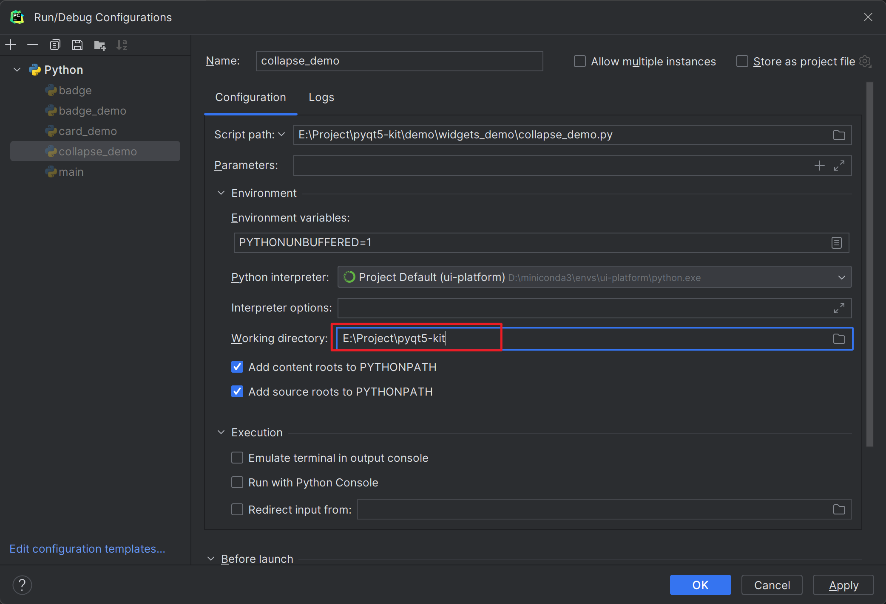

# 项目说明

为了快速搭建一个pyqt5的项目，写了这个工程。

# 启动

运行前，要把运行目录改为工程根目录。



# Icon

https://developers.google.com/fonts/docs/material_icons

``` python
Icons.close
```

# script

自己写的一些脚本，用于快速生成一些文件。

# example

run `example/demo.py`